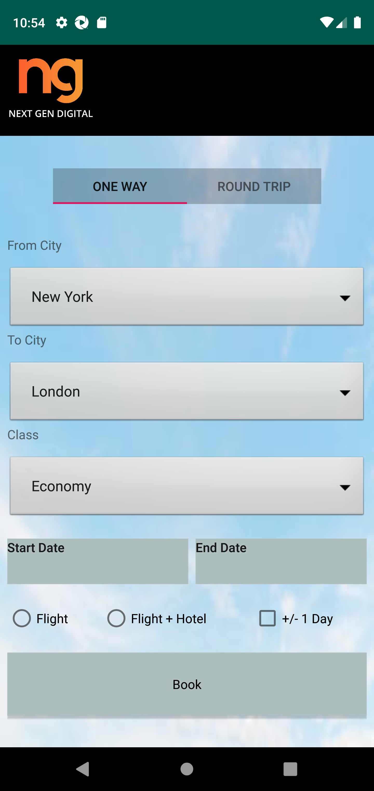
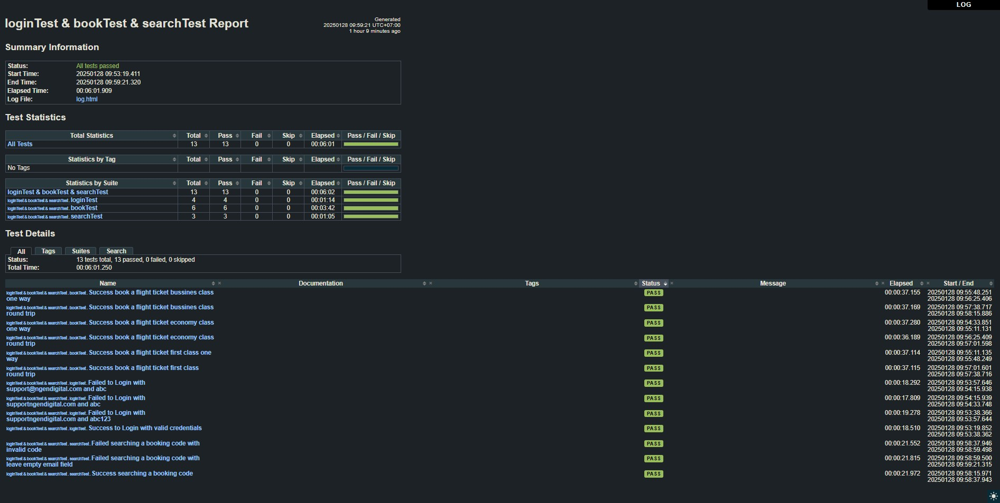

# Quiz 3 Sanbercode QA Bootcamp 63
## Mobile Automation Flight App using Robot Framework and Appium

<p align="center">
    
</p>

This project focuses on practicing functional mobile automation testing on the Flight App (a demo application) using Robot Framework and Appium. The goal of this project is to enhance mobile automation testing skills and fulfill responsibilities from a bootcamp I participated in. The project covers critical user workflows, including scenarios for Login to Account, Booking a One Way Trip, Booking a Round Trip and Search a Booking code.

## Test Cases and Demo Video
- **Test Case, Click Here!**: https://docs.google.com/spreadsheets/d/1ApdKCiUPD21bazp0a2tqLUaMsYfxSCXr3-p0CZsMRyA/edit?gid=1379220632#gid=1379220632
- **Demo Video Youtube, Click Here!**: 

## Project Overview
### Screnshot of Fligt App
Here are some screenshots of the Flight App:

| Home Page           | Booking Page        | Search Page         |
|---------------------|----------------------|----------------------|
|  |  |  |
| Home Page           | Booking Page         | Search Page          |

The project file for execute test robot:
- **loginTest.robot**
- **bookTest.robot**
- **searchTest.robot**

## Screnshots Report
Regression report test results


## **├─** Project Structure
 ```bash
├───app
├───pageObject
    ├───book───bookpage_locator.yaml
        ├───confirm───confirmpage_locator.yaml
        └───finish───finishpage_locator.yaml
    ├───home───homepage_locator.yaml
    ├───login───loginpage_locator.yaml
    └───search───searchpage_locator.yaml
└───test
    ├───base───base.robot
    ├───keyword
        ├───book───bookPage.robot
        ├───home───homePage.robot
        ├───login───loginPage.robot
        └───search──searchPage.robot
    └───suites
        ├───bookTest.robot
        ├───loginTest.robot
        └───serachTest.robot
 ```
 
 ## Happy Testing! 🚀